<<<<<<< Updated upstream
````markdown
# 📚 AdriTeca

<p align="center">


</p>

<p align="center">


</p>
<p align="center">

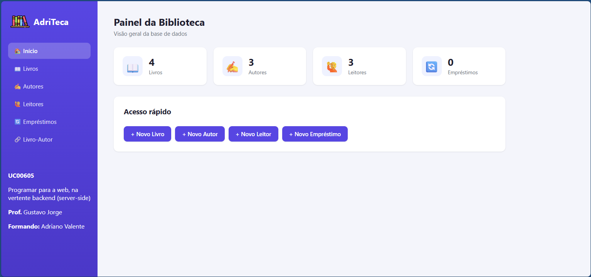

</p>
> **Library Management System developed with PHP and MySQL**

A complete Library Management System developed using **PHP**, **MySQL**, **HTML** and **CSS**. AdriTeca allows users to manage books, authors, readers and loans through an intuitive CRUD interface and a clean dashboard.

This project was developed as part of my learning journey in **Web Development**, **PHP Programming**, **Relational Databases** and **Information Systems**.

---

# ✨ Features

## 📖 Book Management

- Add books
- Edit books
- Delete books
- List all books
- Store ISBN, title, genre and publication year

---

## ✍️ Author Management

- Add authors
- Edit authors
- Delete authors
- Associate one or more authors with each book

---

## 👥 Reader Management

- Register readers
- Update reader information
- Delete readers
- Manage contact details

---

## 🔄 Loan Management

- Create loans
- Register returns
- View active loans
- View completed loans
- Track overdue loans

---

## 📊 Dashboard

The application dashboard displays:

- 📚 Total Books
- ✍️ Total Authors
- 👥 Total Readers
- 🔄 Total Loans
- ⏰ Overdue Loans

---

# 🛠 Technologies

- PHP 8
- MySQL
- MariaDB
- HTML5
- CSS3
- SQL
- XAMPP

---

# 📂 Project Structure

```text
AdriTeca/
│
├── assets/
│   └── style.css
│
├── includes/
│
├── livros/
│
├── autores/
│
├── leitores/
│
├── emprestimos/
│
├── livro_autor/
│
├── image/
│
├── config.php
├── index.php
├── biblioteca.sql
├── database.sql
└── README.md
```

---

# ⚡ Quick Start

Getting AdriTeca running takes only a few minutes.

1. Install XAMPP
2. Clone this repository
3. Copy the project to **htdocs**
4. Import **biblioteca.sql**
5. Start Apache and MySQL
6. Open:

```
http://localhost/AdriTeca
```

That's it! 🎉

---

# 🚀 Installation Guide

## 1. Install XAMPP

Download and install XAMPP from:

https://www.apachefriends.org/

XAMPP includes:

- Apache
- PHP
- MySQL / MariaDB
- phpMyAdmin

Alternatively, you may use:

- Laragon
- WAMP
- MAMP

---

## 2. Clone the Repository

```bash
git clone https://github.com/adrvalente/adriteca.git
```

or download the ZIP file from GitHub.

---

## 3. Copy the Project

Move the project folder into your web server directory.

### Windows

```text
C:\xampp\htdocs\AdriTeca
```

### macOS

```text
/Applications/XAMPP/htdocs/AdriTeca
```

### Linux

```text
/opt/lampp/htdocs/AdriTeca
```

After copying, your project should look like:

```text
htdocs/
└── AdriTeca/
    ├── index.php
    ├── config.php
    ├── livros/
    ├── autores/
    └── ...
```

---

## 4. Start Apache and MySQL

Open the **XAMPP Control Panel** and click **Start** on:

- Apache
- MySQL

Both services should turn green.

---

## 5. Create the Database

Open:

```
http://localhost/phpmyadmin
```

Create a database named:

```text
biblioteca
```

Select the database and click **Import**.

Choose:

```text
biblioteca.sql
```

Click **Go**.

The following tables will be created automatically:

- livro
- autor
- leitor
- emprestimo
- livro_autor

including sample data.

> **Note:** Use **biblioteca.sql** rather than **database.sql**, as it contains both the database structure and sample records.

---

## 6. Configure the Database Connection

Open:

```php
config.php
```

Default XAMPP configuration:

```php
$servername = "localhost";
$username   = "root";
$password   = "";
$dbname     = "biblioteca";
```

If your MySQL server uses a password, simply update the password field.

---

## 7. Run the Application

Open your browser and navigate to:

```
http://localhost/AdriTeca
```

You should now see the AdriTeca dashboard.

---

# 🖥 Running on Another Computer

Moving AdriTeca to another computer is very simple.

### Copy

- Entire project folder
- biblioteca.sql

Install:

- XAMPP (or similar)

Import:

- biblioteca.sql

Verify:

- config.php

Start:

- Apache
- MySQL

Open:

```
http://localhost/AdriTeca
```

No additional configuration is required when using the default XAMPP settings.

---

# 🗄 Database

AdriTeca uses a relational database with five main tables.

```text
Livro
    │
    ├──────────────┐
    │              │
Emprestimo     Livro_Autor
    │              │
Leitor       Autor
```

Relationships include:

- One reader → many loans
- One book → many loans
- Many books ↔ many authors

---

# 📷 Screenshots

## 📊 Dashboard

<p align="center">

</p>

The dashboard provides a quick overview of the library, including statistics about books, authors, readers and loans.

---

## ⚠️ Dashboard Alerts

<p align="center">
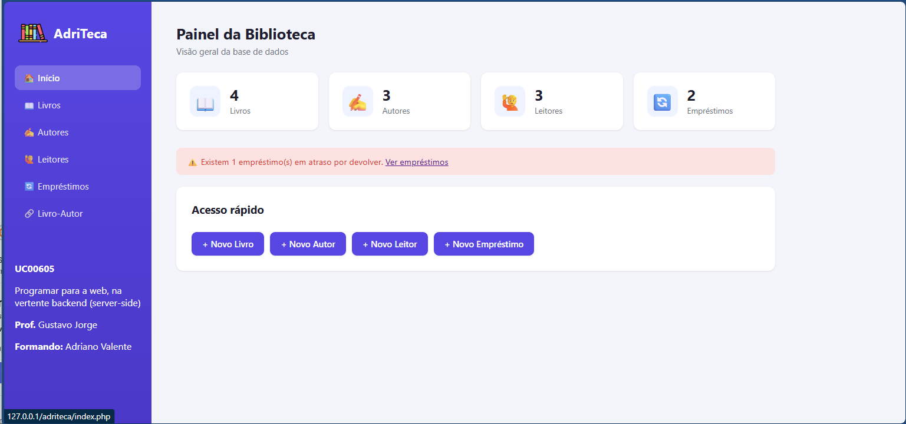
</p>

Displays important notifications, including overdue loans requiring attention.

---

## 📚 Books

| Books List | Add Book |
|------------|----------|
| 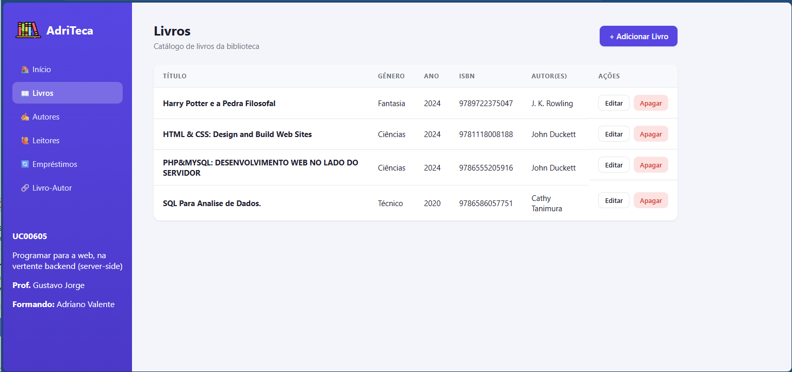 | 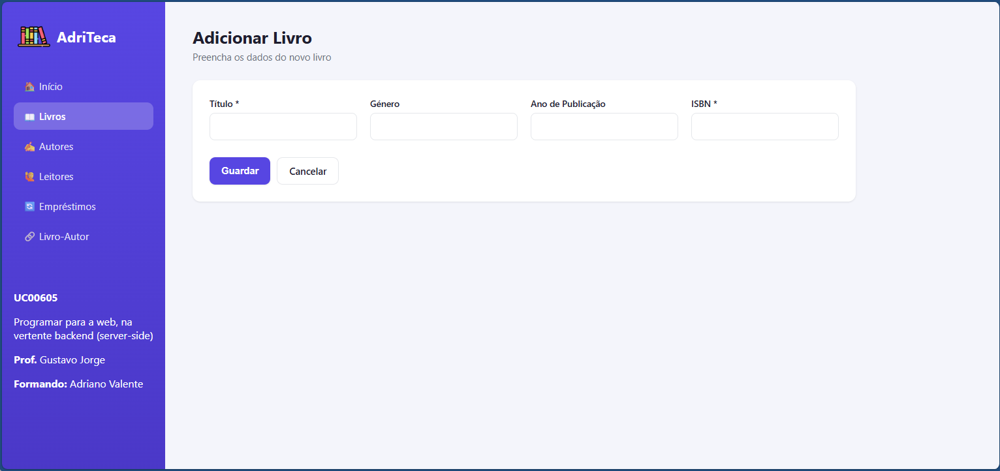 |

Manage the library catalogue by adding, editing and removing books.

---

## ✍️ Authors

| Authors List | Add Author |
|--------------|------------|
| 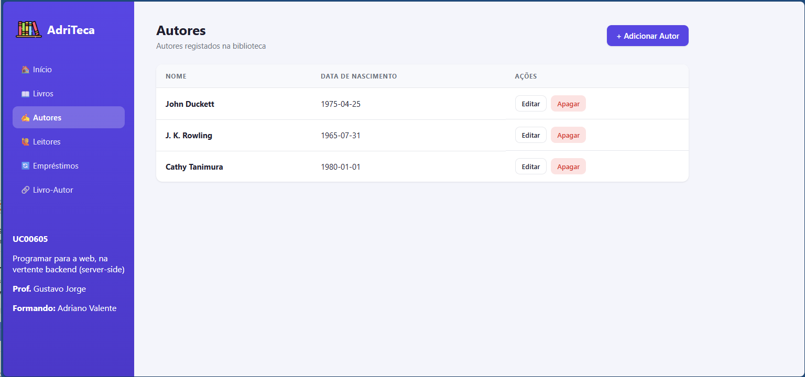 | 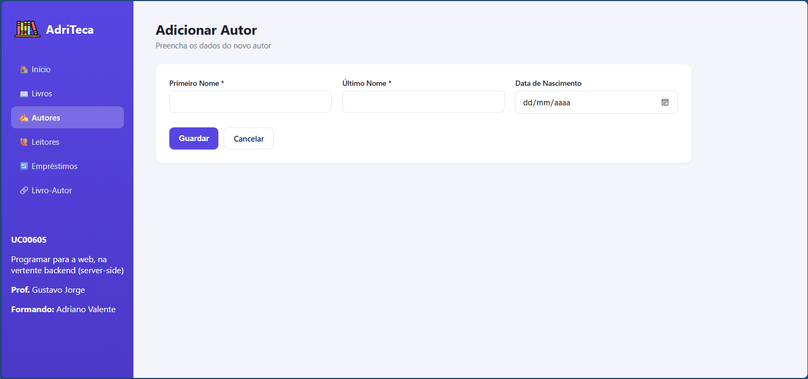 |

Register and maintain author information.

---

## 👥 Readers

| Readers List | Add Reader |
|--------------|------------|
| 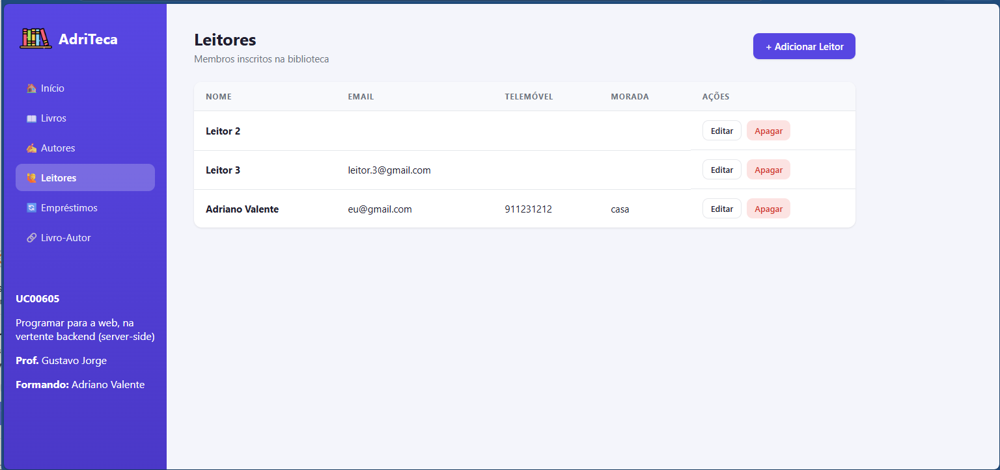 | 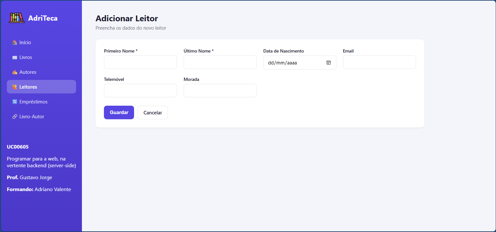 |

Manage reader records and contact information.

---

## 🔄 Loans

| Loans | New Loan |
|--------|----------|
| 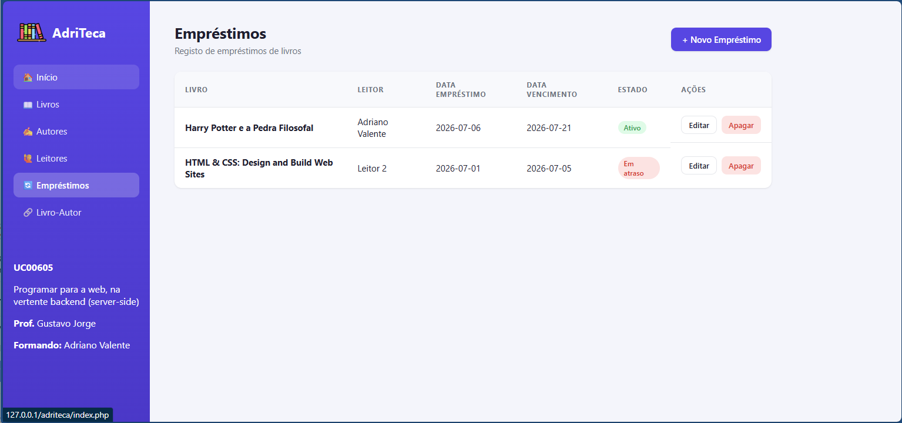 | 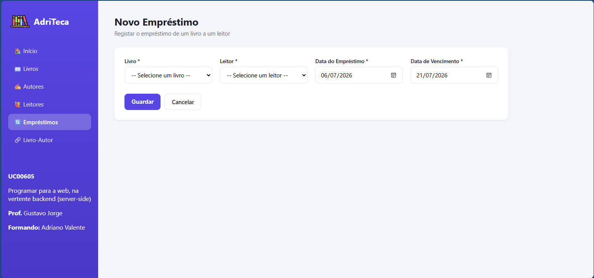 |

Create and manage book loans and returns.

---

## 🔗 Book–Author Associations

| Associations | New Association |
|--------------|-----------------|
| 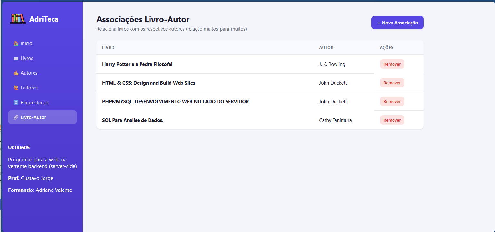 | 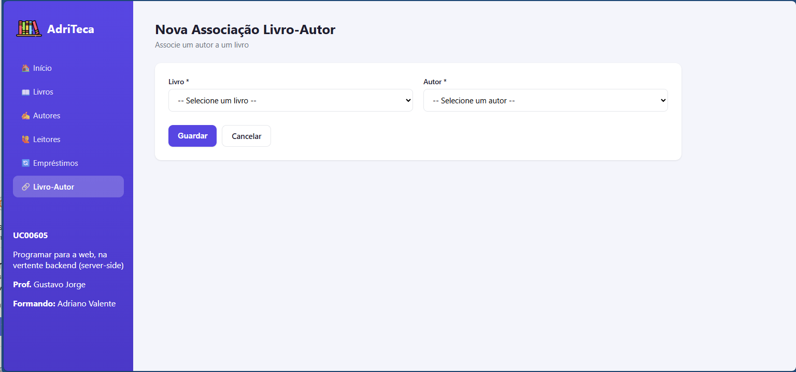 |

Associate one or more authors with each book through a many-to-many relationship.

---

---

# 🎯 Learning Objectives

This project demonstrates practical knowledge of:

- PHP Programming
- CRUD Operations
- Relational Databases
- SQL
- MySQL
- Database Relationships
- Responsive Interfaces
- Server-side Development
- MVC-inspired project organisation

---

# 🚀 Future Improvements

Planned features:

- User authentication
- Administrator roles
- Search engine
- Filters
- Pagination
- Book cover images
- PDF export
- Excel export
- REST API
- Responsive improvements
- Loan reminders
- Statistics dashboard

---

# 📚 Educational Context

Developed as part of my personal portfolio and learning journey in:

- Web Development
- Database Management
- Information Systems
- Software Development
- PHP Programming

---

# 👨‍💻 Author

**Adriano Valente**

IT Support • QA • Software Developer Student

### GitHub

https://github.com/adrvalente

### Portfolio

https://adrvalente.github.io/

---

# 📄 License

This project is licensed under the MIT License.

Feel free to use it for educational purposes.

---

⭐ If you found this project useful, consider giving it a **Star**.
````
=======
AdriTeca 📚

Sistema de gestão de biblioteca em PHP + MySQL (Livros, Autores, Leitores e Empréstimos).

O que é preciso instalar

Só é preciso um programa: um servidor local com PHP + MySQL/MariaDB. O mais simples é o XAMPP.


Windows/Mac/Linux: https://www.apachefriends.org/pt_BR/index.html


(Se já tiveres o WAMP, MAMP ou o Laragon instalado, também serve — os passos são muito parecidos.)

Passo a passo (XAMPP)

1. Instalar o XAMPP

Descarrega e instala o XAMPP normalmente (Next, Next, Finish).

2. Copiar o projeto para a pasta certa

Copia a pasta inteira do projeto (AdriTeca) para dentro da pasta htdocs do XAMPP:


Windows: C:\xampp\htdocs\AdriTeca
Mac: /Applications/XAMPP/htdocs/AdriTeca
Linux: /opt/lampp/htdocs/AdriTeca


No final deves ter, por exemplo, C:\xampp\htdocs\AdriTeca\index.php.

3. Ligar o Apache e o MySQL

Abre o XAMPP Control Panel e clica em Start nas linhas:


Apache
MySQL


Ambos devem ficar com fundo verde.

4. Criar a base de dados


Abre o navegador e vai a: http://localhost/phpmyadmin
No menu à esquerda, clica em Novo (New) e cria uma base de dados chamada exatamente:


   biblioteca


Com a base de dados biblioteca selecionada, clica no separador Importar (Import).
Clica em Escolher ficheiro e seleciona o ficheiro biblioteca.sql que vem dentro da pasta do projeto.
Clica em Executar (Go), no fundo da página.


Isto cria automaticamente as tabelas livro, autor, leitor, emprestimo e livro_autor, já com alguns dados de exemplo.


⚠️ Usa o ficheiro biblioteca.sql (não o database.sql, que é apenas a estrutura sem dados, para referência).


5. Verificar a ligação (config.php)

O ficheiro config.php, na raiz do projeto, já vem configurado para as predefinições do XAMPP:

php$servername = "localhost";
$username   = "root";
$password   = "";
$dbname     = "biblioteca";

Se o MySQL do teu XAMPP tiver password definida para o utilizador root (normalmente não tem), muda a linha $password = ""; para a password correta.

6. Abrir o site

No navegador, acede a:

http://localhost/AdriTeca/

Deve aparecer o painel inicial da biblioteca, com o total de livros, autores, leitores e empréstimos.

Estrutura do projeto

AdriTeca/
├── index.php              → Página inicial (dashboard)
├── config.php             → Configuração da ligação à base de dados
├── database.sql           → Apenas a estrutura das tabelas (sem dados)
├── biblioteca.sql         → Base de dados completa a importar (estrutura + dados)
├── assets/style.css       → Estilos do site
├── image/icon.png         → Ícone
├── includes/              → Cabeçalho e rodapé comuns a todas as páginas
├── livros/                → Listar, adicionar, editar e apagar livros
├── autores/               → Listar, adicionar, editar e apagar autores
├── leitores/              → Listar, adicionar, editar e apagar leitores
├── emprestimos/           → Listar, adicionar, editar e apagar empréstimos
└── livro_autor/           → Associação entre livros e autores

>>>>>>> Stashed changes
